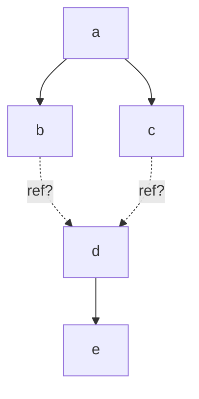
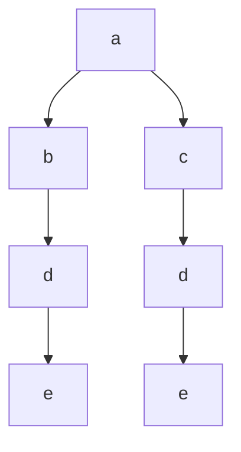
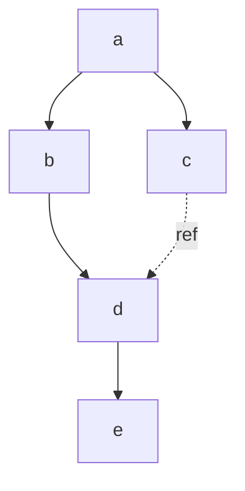
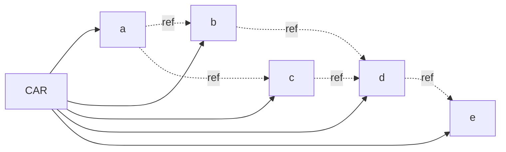

# IPLD Inline Link Specification v0.1.0

## Editors

- [Brooklyn Zelenka], [Fission]

## Authors

- [Irakli Gozalishvili], [Protocol Labs]
- [Philipp Krüger], [Fission] 
- [Brooklyn Zelenka], [Fission]

## Language

The key words "MUST", "MUST NOT", "REQUIRED", "SHALL", "SHALL NOT", "SHOULD", "SHOULD NOT", "RECOMMENDED", "MAY", and "OPTIONAL" in this document are to be interpreted as described in [RFC 2119].

## Dependencies

- [CID]
- [IPLD]

# 0 Abstract

This document presents "IPLD Inline Links", a format for expanding linked graphs "inline". This is helpful when inspecting data as a developer, for passing data to applications that expect tree-structured data, or when you don't know the configuration of the CID of a linked graph.

# 1 Introduction

## 1.1 Motivation

[IPLD] is a format for describing Merkle DAGs with semantics similar to CBOR plus hash linking to other blocks of IPLD. It is an efficient machine encoding, but can be cumbersome to work with in the broader tools ecosystem and developer ergonomics.

### 1.1.1 Containers

IPLD assumes that links will be referenced against a blockstore. The resulting disconnected structures — while efficient for machines — can be cumbersome to work with, debug, inspect, and transmit in non-IPLD aware applications.

The ecosystem of tools for non-IPLD specific tools (JSON tools, CBOR tools, etc) is much wider than those designed for IPLD in particular. To make use of them today, a developer either needs to write custom code, or find an ad hoc method for reifying an IPLD DAG into some format without links such as JSON. Packaging data for 

### 1.1.2 Codecs

By referencing a specific [CID] in a link, the encoding and hash algorithm of that block are forced to be decided ahead of time. While common codecs are supported by most implementations, not all applications will support all possible encodings.

The identity hash has been used for similar use cases, but this has several significant drawbacks including:

- A codec and hash algorithm MUST be decided in advance
- The resulting CID will not directly work with non-IPLD tools (at minimum there's a header)
- Depending on the parameters other than hash, the data may be illegible without further processing
- The identity CID is frozen by the Merkle root of the encoding structure

## 1.2 Inline Links

IPLD Inline Links solve for the above by adding a standard way to inline data in an IPLD document without altering its hash. The ability to inherit the CID configuration (hash, algorithm, base encoding, etc) from the surrounding context is included, but is OPTIONAL.

Inline links do not modify the IPLD data model itself, but rather extend the format in a way that can be round-tripped to and from standard IPLD as desired.

# 2 Format

The basic structure of an inline link is similar to how reference links are represented in the most common IPLD codecs: signalling a link by wrapping the payload in a map with the single `"/"` key. By convention, this signals an IPLD-specific extension to a base codec.

## 2.1 Inline Wrapper

An inline link MUST be signalled by wrapping in a map with a `"/"` key.

``` ipldsch
type InlineWrapper struct {
  inline InlineLink (rename "/")
}
```

## 2.2 Inlined DAG Payload

The inlined DAG payload MUST contain the inlined DAG. The CID MAY be present, omitted, or set to `null`.

``` ipldsch
type InlineLink struct {
  cid nullable Link (implicit Null)
  dag          Any
}
```

### 2.2.1 Explicit

``` js
{
  "name": "Alonzo Church",
  "birthday": {
    "/": {
      "cid": "bafyreif7dowvi5nuzzijawl22vpqsughufapj455diyflrk7htswzbjid4", // DAG-CBOR & SHA2-256
      "dag": {
        "day": 14,
        "month": 6
      }
    }
  }
}
```

Explicit encoding and hash algorithm work as normal: the CID MAY be given in advance via the `"cid"` field, and MUST validly describe the `"dag"` field. 
 
### 2.2.2 Inherited

``` js
{
  "name": "Alonzo Church",
  "birthday": {
    "/": {
      "cid": null, // Inherits encoding & hash algorithm from container
      "dag": {
        "day": 14,
        "month": 6
      }
    }
  }
}

// Or omit the "cid" field

{
  "name": "Alonzo Church",
  "birthday": {
    "/": {
      "dag": {
        "day": 14,
        "month": 6
      }
    }
  }
}
```

Inherited encoding is helpful in many situations. A core intention of IPLD is to abstract away from the exact data encoding. When including a link in IPLD, a hash algorithm and encoding MUST be hardcoded. Such choices are often premature, and lead to awkward design choices to avoid this encoding, or exceptions in prose.

Inheriting from the surrounding context enables a level of flexibility for the nested data. Its hash and encoding MUST be the same as the parent, which is by far the most common case. In order to calculate the hash of the entire structure, the direct parent's encoding MUST be known, then passed to the encoder for the nested graph, the CID calculated, and placed into the parent. See more in [IPLD Canonicalization].

The implicit strategy MAY lead to cases where the same DAG generates different CIDs in the same structure, based on different parent encoding contexts.

## 2.3 Capsule

To signal that a payload contains inlined links, the following capsule MAY be used:

``` ipldsch
type InlineLinkCapsule struct {
  c Any (rename "ipld/inline/v0.1")
}
```

# 3 Encoding Strategies

> In principle, inlining is dead simple: just replace the call of a function by an instance of its body. But any compiler-writer will tell you that inlining is a black art, full of delicate compromises that work together to give good performance without unnecessary code bloat.
>
> — [SPJ] & [Simon Marlow], [Secrets of the Glasgow Haskell Compiler inliner][GHC Secrets]

Encoding is trivial on many structures, such as linked lists and trees. The existence of diamond graphs pose a special problem: how many times should a linked graph be inlined versus referenced?



There are two basic strategies that take advantage of inlining: redundancy and [spanning tree]s. When inlining is not used, the strategy is a form of tabling ([CAR] files and blockstores), and are included here for completeness.

| Representation | Inlining Strategy   | Space | Traversal                      | Typical Implementation      |
|----------------|---------------------|-------|--------------------------------|-----------------------------|
| Redundant Tree | Always              | Large | Fast                           | Standard JSON, CBOR, etc    |
| Spanning Tree  | Once per unique CID | Small | Often slow; depends on content | DAG-JSON, DAG-CBOR, etc     |
| Table          | Never               | Small | Medium                         | [CAR] file, blockstore, etc |

These strategies MAY be mixed: there is no way to enforce that they be purely adhered to.

## 3.1 Redundant Tree

The naive strategy inlines the nested DAG everywhere it is found. This trades off redundancy for simplicity: any part of the graph MAY be explored completely locally. If the graph is deep, this strategy MUST copy any linked children as well.

Redundant trees have the best performance when working with data directly in memory as there is no indirection.



## 3.2 Spanning Tree

A balance between fully tabling connected graphs and inlining everywhere is inlining once and using references elsewhere. This MAY be achieved with a [spanning tree].

As a data transfer format, this encoding is often convenient. It eliminates the need for a special decoder and can use standard tools from JSON and CBOR. Spanning trees are often much smaller than redundant trees, and equal to or slightly smaller than an equivalent CAR file.

There is a performance penalty when using a spanning tree directly in memory since some links are references. Following those links requires scanning the entire structure per some rule, such as keeping all inlined links as far to the left as possible. However, this is less efficient than the inlined or tabled strategies. It is RECOMMENDED that if the data be unpacked to a more efficient structure (either lazily at runtime, or eagerly ahead of time) if it is heavily cross-linked.



## 3.3 Tabling

Included here for completeness, a tabling strategy SHOULD be used when no inlining is desired. This is often the most efficient strategy for storage and retrieval of cross-linked data.



# 4 IPLD Canonicalization

Inline links MUST NOT be used in calculation of CIDs. The only time that inline links interact with CIDs MUST be when inheriting the CID configuration from the parent context.

To calculate the CID of a DAG that contains inline links, first walk the graph and replace all inline links with regular CID links (i.e. of the format `{"/": <cid>}`). This MUST be performed recursively when encountering an inline link. Once converted to normal IPLD, proceed as normal.

## 4.1 Example

``` js
// Implicit inline inside DAG-CBOR with SHA2-256
{
  "name": "Alonzo Church",
  "birthday": {
    "/": {
      "cid": null,
      "dag": {
        "day": 14,
        "month": 6
      }
    }
  }
}

// Converted to explicit CID
{
  "name": "Alonzo Church",
  "birthday": {
    "/": {
      "cid": "bafyreif7dowvi5nuzzijawl22vpqsughufapj455diyflrk7htswzbjid4",
      "dag": {
        "day": 14,
        "month": 6
      }
    }
  }
}

// Canonical
{
  "birthday": {"/": "bafyreif7dowvi5nuzzijawl22vpqsughufapj455diyflrk7htswzbjid4"},
  "name": "Alonzo Church"
}
```

# 5 FAQ

## 5.1 Why Shallow Nesting?

The two options explored in this design were nesting the link under a `"/"` key, or adding another key as a sibling at the same level. For these reasons given below, it was decided that the nested strategy is the least likely to be misinterpreted or misimplemented.

### 5.1.1 Sibling DAG

``` json
{ 
  "/": "bafyreif7dowvi5nuzzijawl22vpqsughufapj455diyflrk7htswzbjid4",
  ".": {
    "day": 14,
    "month": 6
  }
}

{ 
  "/": null,
  ".": {
    "day": 14,
    "month": 6
  }
}
```

The advantageous features of the sibling strategy include:

- The link (when present) looks exactly like a normal CID
- It saves a few characters in JSON

### 5.1.2 Shallowly Nested

This is the one described in the specification.

``` json
{ 
  "/": {
    "cid": "bafyreif7dowvi5nuzzijawl22vpqsughufapj455diyflrk7htswzbjid4",
    "dag": {
      "day": 14,
      "month": 6
    }
  }
}

{ 
  "/": {
    "cid": "null",
    "dag": {
      "day": 14,
      "month": 6
    }
  }
}
```

The advantages of the nesting strategy include:

- Distinguishes clearly the case where a `null` CID would otherwise be a parse error
- Namespaces the keys, so that the key for the nested DAG is not 

### 5.1.3 Deeply Nested

``` json
{
  "/": { 
    "bafyreif7dowvi5nuzzijawl22vpqsughufapj455diyflrk7htswzbjid4": {
      "day": 14,
      "month": 6
    }
  }
}

{
  "/": { 
    "auto": {
      "day": 14,
      "month": 6
    }
  }
}
```

The deeply nested strategy is intuitive on first inspection, but has several drawbacks:

- The syntax implies that multiple CIDs could be present (there MUST NOT be multiple)
- Inheriting the CID encoding from the surrounding context requires a special string keyword

[Brooklyn Zelenka]: https://github.com/expede 
[CAR]: https://ipld.io/specs/transport/car/carv1/
[CID]: https://github.com/multiformats/cid
[Fission]: https://fission.codes
[GHC Secrets]: https://www.microsoft.com/en-us/research/wp-content/uploads/2002/07/inline.pdf 
[IPLD Canonicalization]: #4-ipld-canonicalization
[IPLD]: https://ipld.io/docs/
[Irakli Gozalishvili]: https://github.com/Gozala
[Philipp Krüger]: https://github.com/matheus23
[Protocol Labs]: https://protocol.ai/
[RFC 2119]: https://www.rfc-editor.org/rfc/rfc2119
[SPJ]: https://en.wikipedia.org/wiki/Simon_Peyton_Jones
[Simon Marlow]: https://en.wikipedia.org/wiki/Simon_Marlow
[spanning tree]: https://en.wikipedia.org/wiki/Spanning_tree
