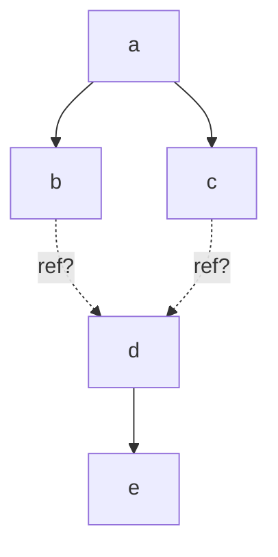
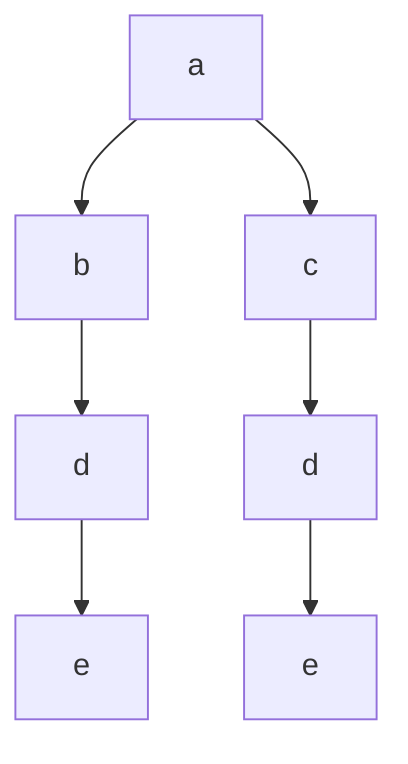
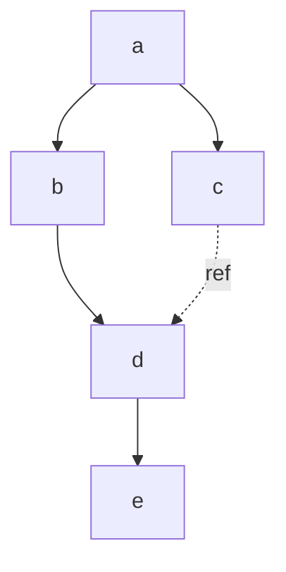
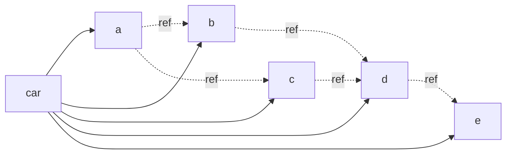

# IPLD Inline Link Specification v0.1.0
-- FIXME transclusion?

## Editors

* [Brooklyn Zelenka], [Fission]

## Authors

* [Brooklyn Zelenka], [Fission]

<!-- 
TODO ask them! Otherwise move to the acknowledgements
* [Irakli Gozalishvili], [Protocol Labs]
* [Philipp Krüger], [Fission] 
-->

## Language

The key words "MUST", "MUST NOT", "REQUIRED", "SHALL", "SHALL NOT", "SHOULD", "SHOULD NOT", "RECOMMENDED", "MAY", and "OPTIONAL" in this document are to be interpreted as described in [RFC 2119].

## Dependencies

* [IPLD]

# 0 Abstract

Spanning DAG is a container for IPLD which exists somewhere between an unpacked representation and a [CAR file]. It includes many quality of life features including inlined linked DAGs and inherited encoding.

# 1 Introduction

# 1.1 Motivation

[IPLD] is a format for describing Merkle DAGs with semantics similar to CBOR plus hash linking to other IPLD. The standard 

It is often desirable to print IPLD with links inlined.

There's a difference in hashing between having data inline versus inserting a link. This helps. BUt also when you do this normally, you have to pick an encoding: you can just inherit.

Versus identity CIDs.

## 1.2 Design

[IPLD] is a deterministic encoding scheme for data expressed in [common types][IPLD Data Model] plus content addressed links. The links are typically tabled.

Versus CARs which are tables

Combinng the two

# 2 Format

The basic structure of an inline link is similar to how reference links are represented in the most common IPLD codecs: signalling a link by wrapping the payload in a map with the single `"/"` key. By convention, this signals an IPLD-specific extension to a base codec.

## 2.1 Inline Wrapper

An inline link MUST be signalled by wrapping in a map with a `"/"` key.

``` ipldsch
type InlineWrapper struct {
  inline InlineLink (rename "/")
}
```

## 2.2 Inlined DAG Payload

The inlined DAG payload MUST contain the inlined 

``` ipldsch
type InlineLink struct {
  cid nullable Link (implicit Null)
  dag          Any
}
```

### 2.2.1 Explicit Encoding

``` js
{
  "name": "Alonzo Church",
  "birthdate": {
    "/": {
      "cid": "bafyreif7dowvi5nuzzijawl22vpqsughufapj455diyflrk7htswzbjid4", // Encoded as DAG-CBOR
      "dag": {
        "day": 14,
        "month": 6
      }
    }
  }
}
```

### 2.2.2 Inherited Encoding

``` js
{
  "name": "Alonzo Church",
  "birthdate": {
    "/": {
      "cid": null, // Inherits encoding from container
      "dag": {
        "day": 14,
        "month": 6
      }
    }
  }
}
```

# 3 Consequences
 
> In principle, inlining is dead simple: just replace the call of a function by an instance of its body. But any compiler-writer will tell you that inlining is a black art, full of delicate compromises that work together to give good performance without unnecessary code bloat.
>
> — [SPJ] & [Simon Marlow], [Secrets of the Glasgow Haskell Compiler inliner][GHC Secrets]
 
Note! Cannot just hash to check anymore. You need to actually unpack the container.

optionally wrap the entire thig in a Wraper.

Spanning trees

Similar to `{"/": {"bytes": ...}}`

# 4 Canonicalization

# 5 Encoding Strategies

Encoding is trivial on many structures, such as linked lists and trees. The existence of diamond graphs pose a special problem: how many times should a linked graph be inlined versus referenced?



There are three basic strategies: duplication, spanning trees, and tabling. [CAR] files (and block stores) already handle the tabled approach, and so do not require discussion here.

## 5.1 Duplication

The naive strategy inlines the nested DAG everywhere it is found. This trades off redundancy for simplicity: any part of the graph MAY be explored completely locally. If the graph is deep, this strategy MUST copy any linked children as well.



## 5.2 Minimal Spanning Tree

A balance between fully tabling connected graphs and inlining everywhere is inlining once and using references elsewhere. This MAY be achieved with a [minimal spanning tree][^no enforce]. 

As a data transfer format, this encoding is often convenient. It eliminates the need for a special decoder and can use standard tools for e.g. JSON and CBOR. 

[^no enforce]: Please note that there is no way to enforce that the spanning tree be minimal.



## 5.3 CAR File




<!-- TODOS -->

```
-- FIXME use a feature table instead?
type SpanningCapsule struct {
  capsule Any (rename "ipld/spanning/v0.1")
  canon   Bool (implicit false)
}

type FeatureTable struct {
   
}

type Capsule struct {
  head FeatureTable (implicit {})
  data Any (rename "ipld/ext/v0.1")
}
```

<!-- Links -->

[Brooklyn Zelenka]: https://github.com/expede 
[Fission]: https://fission.codes
[Irakli Gozalishvili]: https://github.com/Gozala
[Philipp Krüger]: https://github.com/matheus23
[GHC Secrets]: https://www.microsoft.com/en-us/research/wp-content/uploads/2002/07/inline.pdf 
