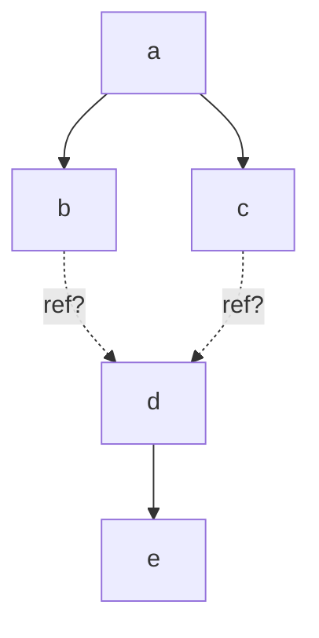
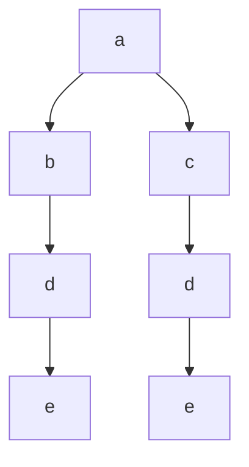
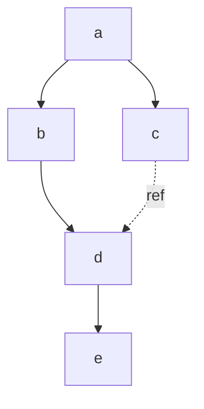
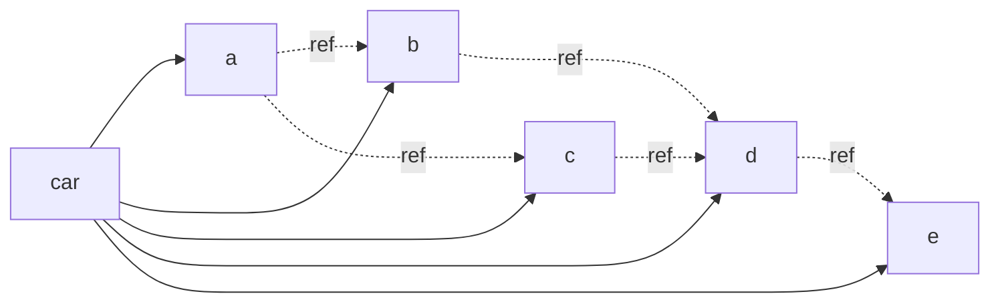

# IPLD Inline Link Specification v0.1.0
-- FIXME transclusion?

## Editors

* [Brooklyn Zelenka], [Fission]

## Authors

* [Brooklyn Zelenka], [Fission]

<!-- 
TODO ask them! Otherwise move to the acknowledgements
* [Irakli Gozalishvili], [Protocol Labs]
* [Philipp Krüger], [Fission] 
-->

## Language

The key words "MUST", "MUST NOT", "REQUIRED", "SHALL", "SHALL NOT", "SHOULD", "SHOULD NOT", "RECOMMENDED", "MAY", and "OPTIONAL" in this document are to be interpreted as described in [RFC 2119].

## Dependencies

* [IPLD]

# 0 Abstract

IPLD Inline Links are a format for including linked graphs in 

Spanning DAG is a container for IPLD which exists somewhere between an unpacked representation and a [CAR file]. It includes many quality of life features including inlined linked DAGs and inherited encoding.

# 1 Introduction

# 1.1 Motivation

[IPLD] is a format for describing Merkle DAGs with semantics similar to CBOR plus hash linking to other IPLD. The standard 

It is often desirable to print IPLD with links inlined.

There's a difference in hashing between having data inline versus inserting a link. This helps. BUt also when you do this normally, you have to pick an encoding: you can just inherit.

Versus identity CIDs.

## 1.2 Design

[IPLD] is a deterministic encoding scheme for data expressed in [common types][IPLD Data Model] plus content addressed links. The links are typically tabled.

Versus CARs which are tables

Combinng the two

# 2 Format

The basic structure of an inline link is similar to how reference links are represented in the most common IPLD codecs: signalling a link by wrapping the payload in a map with the single `"/"` key. By convention, this signals an IPLD-specific extension to a base codec.

## 2.1 Inline Wrapper

An inline link MUST be signalled by wrapping in a map with a `"/"` key.

``` ipldsch
type InlineWrapper struct {
  inline InlineLink (rename "/")
}
```

## 2.2 Inlined DAG Payload

The inlined DAG payload MUST contain the inlined 

``` ipldsch
type InlineLink struct {
  cid nullable Link (implicit Null)
  dag          Any
}
```

### 2.2.1 Explicit Encoding

``` js
{
  "name": "Alonzo Church",
  "birthdate": {
    "/": {
      "cid": "bafyreif7dowvi5nuzzijawl22vpqsughufapj455diyflrk7htswzbjid4", // Encoded as DAG-CBOR
      "dag": {
        "day": 14,
        "month": 6
      }
    }
  }
}
```

### 2.2.2 Inherited Encoding

``` js
{
  "name": "Alonzo Church",
  "birthdate": {
    "/": {
      "cid": null, // Inherits encoding from container
      "dag": {
        "day": 14,
        "month": 6
      }
    }
  }
}
```

# 3 Consequences
 
> In principle, inlining is dead simple: just replace the call of a function by an instance of its body. But any compiler-writer will tell you that inlining is a black art, full of delicate compromises that work together to give good performance without unnecessary code bloat.
>
> — [SPJ] & [Simon Marlow], [Secrets of the Glasgow Haskell Compiler inliner][GHC Secrets]
 
Note! Cannot just hash to check anymore. You need to actually unpack the container.

optionally wrap the entire thig in a Wraper.

Spanning trees

Similar to `{"/": {"bytes": ...}}`

# 4 Canonicalization

# 5 Encoding Strategies

Encoding is trivial on many structures, such as linked lists and trees. The existence of diamond graphs pose a special problem: how many times should a linked graph be inlined versus referenced?



There are two basic strategies that take advatage of inlining: duplication and spanning trees. When inlinig is not used, the strategy is a form of tabling (CAR files and blockstores), and are included here for completeness.

| Name                  | Inlining Strategy   | Space | Lookup | Example Implementation |
|-----------------------|---------------------|-------|--------|------------------------|
| Redundant Tree        | Always              | Large | Fast   | Tree (JSON, CBOR)      |
| Minimal Spanning Tree | Once per unique CID | Small | Slow   | Tree (JSON, CBOR)      |
| Table                 | Never               | Small | Medium | CAR file, blockstore   |

These strategies MAY be mixed: there is no way to encoforce that they be purely adhered to.

## 5.1 Redundant Tree

The naive strategy inlines the nested DAG everywhere it is found. This trades off redundancy for simplicity: any part of the graph MAY be explored completely locally. If the graph is deep, this strategy MUST copy any linked children as well.

Redundant trees have the best performance when working with data directly in memory as there is no indirection.



## 5.2 Minimal Spanning Tree

A balance between fully tabling connected graphs and inlining everywhere is inlining once and using references elsewhere. This MAY be achieved with a [minimal spanning tree].

As a data transfer format, this encoding is often convenient. It eliminates the need for a special decoder and can use standard tools from JSON and CBOR. Minimal spanning trees are often much smaller than redundant trees, and equal to or slightly smaller than an equivalent CAR file.

There is a performance penalty when using a minimal spanning tree directly in memory since some links are references. Following those links requires scanning the entire structure per some rule, such as keeping all inlined links as far to the left as possible. However, this is less efficient than the inlined or tabled strategies. It is RECOMMENDED that if the data be unpacked to a more efficient strutcure (either lazily at runtime, or eagerly ahead of time) if it is heavily cross-linked.



## 5.3 Tabling

Included here for completeness, a tabling strategy SHOULD be used when no inlining is desired. This is often the most efficient strategy for storage and retrieval of cross-linked data.



# 6 FAQ

## 6.1 Why Use Nesting?

The two options explored in this design were nesting the link under a `"/"` key, or adding another key as a sibing at the same level. For these reasons given below, it was decided that the nested strategy is the least likely to be misinterpreted or misimplemented.

### 6.1.1 Sibling Strategy

This is the one described in the specification.

``` json
{ 
  "/": "bafyreif7dowvi5nuzzijawl22vpqsughufapj455diyflrk7htswzbjid4",
  ".": {
    "day": 14,
    "month": 6
  }
}

{ 
  "/": null,
  ".": {
    "day": 14,
    "month": 6
  }
}
```

The advantagous features of the sibling strategy include:

- The link (when present) looks exactly like a normal CID
- It saves a few characters in JSON

### 6.1.2 Shallowly Nested

``` json
{ 
  "/": {
    "cid": "bafyreif7dowvi5nuzzijawl22vpqsughufapj455diyflrk7htswzbjid4",
    "dag": {
      "day": 14,
      "month": 6
    }
  }
}

{ 
  "/": {
    "cid": "null",
    "dag": {
      "day": 14,
      "month": 6
    }
  }
}
```

The advantages of the nesting strategy include:

- Distinguishes clearly the case where a `null` CID would otherwise be a parse error
- Namespaces the keys, so that the key for the nested DAG is not 

### 6.1.3 Deeply Nested

``` json
{
  "/": { 
    "bafyreif7dowvi5nuzzijawl22vpqsughufapj455diyflrk7htswzbjid4": {
      "day": 14,
      "month": 6
    }
  }
}

{
  "/": { 
    "auto": {
      "day": 14,
      "month": 6
    }
  }
}
```

The deeply nested strategy is intuitive on first inspection, but has several drawbacks:

- The syntax implies that multiple CIDs could be present (there MUST NOT be multiple)
- Inheriting the CID encoding from the surrounding context requires a special string keyword

<!--
# 6 Feature Signalling

Extended IPLD / xIPLD

``` json
{
  "xipld/v0.1": {
    "h": {
      "inline": "true",
      "foo": "bar"
     },
    "d": {
      "hello": "world",
      "time": 1234567890
    }
  }
}
```

``` ipldsch
type ExtendedIPLD struct {
  head {String : Any}
  data Any (rename "xipld/v0.1")
}
```
-->

[Brooklyn Zelenka]: https://github.com/expede 
[Fission]: https://fission.codes
[Irakli Gozalishvili]: https://github.com/Gozala
[Philipp Krüger]: https://github.com/matheus23
[GHC Secrets]: https://www.microsoft.com/en-us/research/wp-content/uploads/2002/07/inline.pdf 
